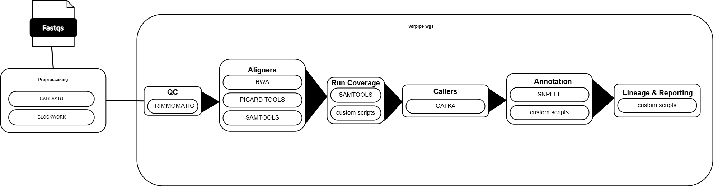

```md
Org: NCEZID
Contact Email: ncezid_shareit@cdc.gov
Exemption: exemptByAgencySystem
Exemption Justification: Code is owned by CDC surveillance programs; this repository includes compatibility changes for AMD Platform
Status: Maintained
Keywords: bioinformatics
Version: 1.2.0
Contract#: 47QFCA23F0058
```

# amd-ph-core/tbvarpipe

[](https://github.com/amd-ph-core/tbvarpipe/actions/workflows/nf-test.yml)
[](https://github.com/amd-ph-core/tbvarpipe/actions/workflows/linting.yml)
[](https://www.nf-test.com)

[](https://www.nextflow.io/)
[](https://github.com/nf-core/tools/releases/tag/3.3.2)
[](https://docs.conda.io/en/latest/)
[](https://www.docker.com/)
[](https://sylabs.io/docs/)
[](https://cloud.seqera.io/launch?pipeline=https://github.com/amd-ph-core/tbvarpipe)

## Introduction

**amd-ph-core/tbvarpipe** is a bioinformatics pipeline that contains a refactored version of the [CDC Varpipe-WGS pipeline](https://github.com/CDCgov/NCHHSTP-DTBE-Varpipe-WGS) originally developed by the Division of TB Elimination to perform data cleaning and analysis (typing and variant detection).



## Pipeline Steps

### 1. Preprocessing

- 1.1 Fastq lane concatenation
  - Custom script that concatenates R1 and R2 fastq.gz file pairs with up to 4 lanes into a single pair of fastq files for R1 and R2.

### 2. varpipe-wgs

- 2.1 QC
  - Performs QC on samples using trimmomatic, yielding cleaned reads for downstream analysis.

- 2.2 Alignment [subworkflow/varpipe_processbam](subworkflows/varpipe_processbam)
  - Prepares high-quality BAM files from cleaned reads from 2.1 by performing alignment, sorting, duplicate marking, and indexing using bwa, samtools, and picard.

- 2.3 Coverage Analysis [subworkflows/varpipe_core](subworkflows/varpipe_core)
  - Analyzes genome coverage depth and produces coverage statistics, qc logs, and structural variant analysis

- 2.4 Variant Calling [subworkflows/varpipe_variantanalysis](subworkflows/varpipe_variantanalysis)
  - Identifies and annotates somatic variants using gatk4 for both whole genome analysis and drug resistant (DR) analysis.

- 2.5 Variant Annotation [subworkflows/varpipe_core](subworkflows/varpipe_core)
  - Annotates identified variants and creates annotation files using vcf output from 2.4

- 2.6 Lineage and Reporting [subworkflows/varpipe_core](subworkflows/varpipe_core)
  - Traces sample lineage and creates a final report for analysis

## Usage

> [!NOTE]
> If you are new to Nextflow and nf-core, please refer to [this page](https://nf-co.re/docs/usage/installation) on how to set-up Nextflow. Make sure to [test your setup](https://nf-co.re/docs/usage/introduction#how-to-run-a-pipeline) with `-profile test` before running the workflow on actual data.

First, navigate to nextflow.config and update paths to the knowledge bases.

Then, prepare a samplesheet with your input data that looks as follows (see example in assets folder):

`samplesheet.csv`:

```csv
sample,fastq_1,fastq_2,fastq_3,fastq_4,fastq_5,fastq_6,fastq_7,fastq_8
24P001,AZ-2024TB-0075_S15_L001_R1_001.fastq.gz,AZ-2024TB-0075_S15_L001_R2_001.fastq.gz
24P002,AZ-2024TB-0075_S15_L001_R1_001.fastq.gz,AZ-2024TB-0075_S15_L001_R2_001.fastq.gz,AZ-2024TB-0075_S15_L002_R1_001.fastq.gz,AZ-2024TB-0075_S15_L002_R2_001.fastq.gz,AZ-2024TB-0075_S15_L003_R1_001.fastq.gz,AZ-2024TB-0075_S15_L003_R2_001.fastq.gz,AZ-2024TB-0075_S15_L004_R1_001.fastq.gz,AZ-2024TB-0075_S15_L004_R2_001.fastq.gz
```

Each row represents a paired-end fastq file. The column 'sample' contains the Sample ID for the files and the columns fastq\_# contains paths to the sample fastq files, with each column containing a single path. Files should be ordered by lane (i.e. fastq_1 is L001_R1, fastq_2 is L001_R2, fastq_3 is L002_R1, fastq_4 is L002_R2 and so forth).

Now, you can run the pipeline using:

```bash
nextflow run amd-ph-core/tbvarpipe \
    -profile <singularity/docker/.../> \
    --input <samplesheet.csv> \
    --outdir <OUTDIR> \
```

- _If running in AWS Batch, you must use `-profile docker -c <environment config>` and add a working directory using `-work-dir`_

> [!WARNING]
> Please provide pipeline parameters via the CLI. Custom config files including those provided by the `-c` Nextflow option can be used to provide any configuration;
> see [docs](https://nf-co.re/usage/configuration#custom-configuration-files).

## Credits

The varpipe pipeline was originally written by the Laboratory Branch (LB) of the Division of Tuberculosis Elimination.

The Nextflow DSL2 conversion and code modernization of the pipeline was lead by AMD Platform

We thank the following people for their extensive assistance in the development of this pipeline:

- [Savannah Linen](https://github.com/ztb2)
- [Thomas Stark](https://github.com/tstark-cdc)
- [James Smagala](https://github.com/smagala)
- [Matthew Ezewudo](https://github.com/krt7-cdc)
- [Lauren Cowan](https://github.com/los4-cdc)
- [James Posey](https://github.com/hzp9-cdc)

## Citations

An extensive list of references for the tools used by the pipeline can be found in the [`CITATIONS.md`](CITATIONS.md) file.

This pipeline uses code and infrastructure developed and maintained by the [nf-core](https://nf-co.re) community, reused here under the [MIT license](https://github.com/nf-core/tools/blob/main/LICENSE).

> **The nf-core framework for community-curated bioinformatics pipelines.**
>
> Philip Ewels, Alexander Peltzer, Sven Fillinger, Harshil Patel, Johannes Alneberg, Andreas Wilm, Maxime Ulysse Garcia, Paolo Di Tommaso & Sven Nahnsen.
>
> _Nat Biotechnol._ 2020 Feb 13. doi: [10.1038/s41587-020-0439-x](https://dx.doi.org/10.1038/s41587-020-0439-x).

## Public Domain Standard Notice

This repository constitutes a work of the United States Government and is not
subject to domestic copyright protection under 17 USC § 105. This repository is in
the public domain within the United States, and copyright and related rights in
the work worldwide are waived through the [CC0 1.0 Universal public domain dedication](https://creativecommons.org/publicdomain/zero/1.0/).
All contributions to this repository will be released under the
[MIT No Attribution (MIT-0)](LICENSE) license. By submitting a pull request you
are agreeing to comply with this waiver of copyright interest.

## License Standard Notice

This repository is licensed under the [MIT-0](LICENSE) license.

This source code is free: you can redistribute it and/or modify it under the terms
of the MIT-0 license.

This source code is distributed in the hope that it will be useful, but WITHOUT ANY
WARRANTY; without even the implied warranty of MERCHANTABILITY or FITNESS FOR A
PARTICULAR PURPOSE. See the [LICENSE](LICENSE) for more details.

The source code forked from other open source projects will inherit its license.

## Privacy Standard Notice

This repository contains only non-sensitive, publicly available data and
information. All material and community participation is covered by the
[Disclaimer](DISCLAIMER.md).
For more information about CDC's privacy policy, please visit [http://www.cdc.gov/other/privacy.html](https://www.cdc.gov/other/privacy.html).

## Contributing Standard Notice

Anyone is encouraged to contribute to the repository by [forking](https://help.github.com/articles/fork-a-repo)
and submitting a pull request. (If you are new to GitHub, you might start with a
[basic tutorial](https://help.github.com/articles/set-up-git).) By contributing
to this project, you grant a world-wide, royalty-free, perpetual, irrevocable,
non-exclusive, transferable license to all users under the terms of the
[MIT-0](LICENSE) license.

Please see the [contributing guidelines](.github/CONTRIBUTING.md) for more information.

All comments, messages, pull requests, and other submissions received through
CDC including this GitHub page may be subject to applicable federal law, including
but not limited to the Federal Records Act, and may be archived. Learn more at
[http://www.cdc.gov/other/privacy.html](https://www.cdc.gov/other/privacy.html).

## Records Management Standard Notice

This repository is not a source of government records, but is a copy to increase
collaboration and collaborative potential. All government records will be
published through the [CDC web site](http://www.cdc.gov).

## Additional Standard Notices

Please refer to [CDC's Template Repository](https://github.com/CDCgov/template) for more information about [contributing to this repository](https://github.com/CDCgov/template/blob/main/CONTRIBUTING.md), [public domain notices and disclaimers](https://github.com/CDCgov/template/blob/main/DISCLAIMER.md), and [code of conduct](https://github.com/CDCgov/template/blob/main/code-of-conduct.md).
